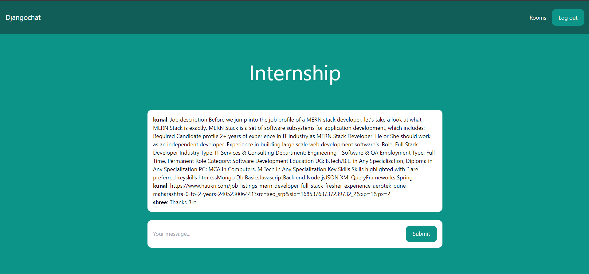

# Djangochat

Learn how to build a real-time chat application using Django and Channels. The design is made using Tailwind CSS.

This repository is done by a part of a video tutorial of  YouTube channel: Code With Stein

## Author
This repository is created by Kunalhume. 
